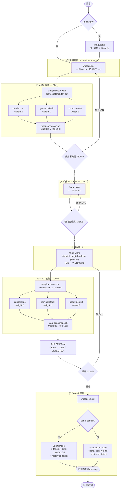
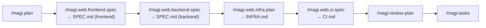

# magi-workflow

> 多模型協作的軟體工程 workflow plugin（for Claude Code）

讓不同階段使用不同 AI 模型發揮各自所長：Opus 規劃、Gemini + Codex + Opus 並行審議、Sonnet 實作、再用 MAGI 加權投票收斂結果。

## 特色

- **多 CLI 並行審議** — `claude` / `gemini` / `codex` 在同一道閘門平行 fan-out，事件流協定 + quota / auth 自動降級
- **MAGI 加權投票** — 4 種模式（majority / supermajority / unanimous / threshold）；reviewer 失敗時退化模式透明標示
- **契約即真理 + 自動 drift 偵測** — `/magi.plan` 寫的 PLAN/SPEC 是凍結契約；`/magi.review-code` 自動比對 code 與契約，輸出 `DRIFT.md`（A 類違反 / B 類自由 / C 類觀察）；`/magi.commit` sprint mode 引導使用者把 A 類回填、C 類升級到 `docs/BACKLOG.md`
- **雙模式 commit** — `/magi.commit` 自動偵測 sprint context；feature work 走 sprint mode、chore/docs/小 fix 走 standalone mode，單一指令通吃所有 commit 情境
- **領域中性** — 核心 slash command（init / plan / tasks / review-plan / work / review-code / commit / setup）不綁特定技術棧
- **Web 領域 add-ons** — frontend / backend / infra / ci 四個專用 spec skill，補強標準 SPEC.md
- **零自動副作用** — 不偷偷 commit / push、不 apply infra、不 trigger deploy；每一步都會停下等使用者確認
- **nvm 相容** — 避開 `#!/usr/bin/env node` 找錯版本的坑（macOS 常踩）
- **團隊化選配** — `references/AGENTS.md` 跨專案守則 SSOT、可選 git hooks（Conventional Commits / lint / WIP 警示）

實作完成度與設計細節見 [`SPEC.md`](SPEC.md)。

## 安裝

### 作為 Claude Code plugin（推薦）

本 repo 自帶 `.claude-plugin/marketplace.json`，是個 single-plugin self-hosted marketplace。兩步：

```bash
claude plugin marketplace add howar31/magi-workflow      # 註冊 marketplace
claude plugin install magi-workflow@magi-workflow        # 安裝 plugin
```

或在 Claude Code session 裡用 slash command：

```
/plugin marketplace add howar31/magi-workflow
/plugin install magi-workflow@magi-workflow
```

安裝後第一件事跑 setup wizard：

```
/magi.setup
```

它會檢查你機器上的 `claude` / `gemini` / `codex`、詢問你想啟用哪幾位 reviewer 與權重、寫入 `~/.config/magi-workflow/config.json`，最後跑一次 dry-run 驗證。

新專案第一次採用 magi-workflow 時跑：

```
/magi.init
```

會偵測缺哪些專案文件（root `CLAUDE.md` / `README.md` / `SPEC.md`、`docs/PRD.md` / `docs/TECHSTACK.md` / `docs/BACKLOG.md`）並逐項問你要不要建立 scaffold。idempotent；既有檔案絕不覆寫。

### 作為本機開發 / 直接跑 shell scripts

```bash
git clone https://github.com/howar31/magi-workflow.git /opt/projects/magi-workflow
cd /opt/projects/magi-workflow
./scripts/shared/preflight.sh        # 健檢
./test/e2e-smoke.sh                  # 真 CLI 端到端
./test/e2e-fallback.sh               # mock adapter，免 token
```

## 環境需求

支援平台：macOS（已測 arm64）、Linux。

| 類別 | 工具 | 用途 / 安裝 |
|------|------|-------------|
| **必要** | `claude` CLI | Coordinator — 主要對話介面。安裝：[claude.ai/download](https://claude.ai/download) 或 npm 套件 `@anthropic-ai/claude-code`。 |
| **必要** | `bash` 3.2+ | 已內建於 macOS / Linux。 |
| **必要** | `jq` | 處理 config / 事件流 JSON。`brew install jq` 或 `apt install jq`。 |
| **選用** | `gemini` CLI | 第二位 reviewer。需 `GEMINI_API_KEY` env 或登入。安裝：[github.com/google-gemini/gemini-cli](https://github.com/google-gemini/gemini-cli)。 |
| **選用** | `codex` CLI | 第三位 reviewer。安裝：[github.com/openai/codex](https://github.com/openai/codex)。 |
| **建議** | `gtimeout`（coreutils） | 子程序逾時控制；macOS 透過 `brew install coreutils` 提供。 |
| **建議** | nvm + Node 20/22 | 給 npm-based CLI（gemini / codex）用，避開系統 node 版本問題。 |

未裝 `jq` 或 `gtimeout` 時 `/magi.setup` 的 preflight 會顯示提示，不會默默壞掉。`gemini` / `codex` 任一個失敗，MAGI 會走退化模式繼續（見下方 Troubleshooting）。

## 使用流程

### 通用流程

```
/magi.setup                        # 第一次先跑這個（global，per-user）
/magi.init                         # 新專案第一次跑這個（per-project bootstrap）

/magi.plan "<功能描述>"            # 產出 docs/<num>-<slug>/PLAN.md 或 SPEC.md（依複雜度自動判斷）
                                   # 或乾跑 /magi.plan 從 docs/BACKLOG.md 挑待 promote 項目
/magi.review-plan                  # 多 CLI MAGI 審 plan
/magi.tasks                        # 拆 TASKS.md
/magi.work                         # 派工 magi-developer 實作
/magi.review-code                  # 多 CLI MAGI 審 code 並自動產出 DRIFT.md（--single 退化單審）
/magi.commit                       # sprint mode：A 類回填 PLAN/SPEC、C 類升級到 BACKLOG、可選 root 同步、conventional commits
                                   # standalone mode：chore/docs/小 fix 直接 commit（無 sprint context 時自動切換）
```

### Web 領域進階流程（在 `/magi.plan` 與 `/magi.tasks` 之間插入）

```
/magi.plan "<功能描述>"
/magi.web.frontend.spec            # 補 frontend spec 段落（component / a11y / e2e）
/magi.web.backend.spec             # 補 backend spec 段落（API contract / migration）
/magi.web.infra.plan               # 產出 INFRA.md (terraform plan dry-run / IAM diff)
/magi.web.ci.spec                  # 產出 CI.md + draft workflow YAML
/magi.review-plan                  # 補完後再 review
/magi.tasks
/magi.work
/magi.review-code
```

每一步都會在使用者面前停下來，等你說「OK 繼續」。

## 工作流總覽



> 圖中三家 reviewer 是預設配置（claude / gemini / codex）；實際啟用哪幾家、權重多少、required 與否，由 `~/.config/magi-workflow/config.json` 控制。

### Web add-ons 插入點



只用到的 add-on 才需要跑；四個彼此獨立。

### 外部 CLI reviewer 怎麼跑

每個 reviewer **不是常駐 process，也不是另一個 slash command** — 是 `orchestrator.sh` 在你手動觸發 `/magi.review-plan` 或 `/magi.review-code` 那一刻才 spawn 出來的 subprocess：

1. 你打 `/magi.review-plan`（或 `/magi.review-code`）
2. Coordinator 讀 `~/.config/magi-workflow/config.json` 的 `xreview.reviewers` 列表
3. `orchestrator.sh` 平行 spawn 每位啟用的 reviewer：
   - `claude --print "<prompt>"`
   - `nvm exec 22 gemini -p "<prompt>"`
   - `nvm exec 22 codex exec "<prompt>"`
4. 每位 reviewer 獨立跑、互相看不到、各自寫到 `<workdir>/<cli>-<model>.final.txt`
5. 任一位失敗（quota / auth / 真錯誤）→ 標記 SKIP/FAIL，其他繼續
6. 全部完成後，`magi-consensus.sh` 收齊 `.final.txt` + 加權投票 → 產出 `magi-report.md`
7. Coordinator 套 `references/MAGI_VOTING.md` 規則做語意去重 + 最終裁決
8. 結果回給你

換言之，**config 控制的是 fan-out 的「組成」與「失敗策略」，不是「啟動時機」**。沒有 cron、沒有 hook、沒有背景 daemon — 一切從你打那條 slash 開始。

## 角色分工

| 角色 | 模型 | 職責 | 不做 |
|------|------|------|------|
| **Coordinator**（main agent） | Opus（你的 Claude Code session） | 規劃、派工、驗收、文件同步、MAGI 投票收斂 | 不寫 production code |
| **`magi-developer`** subagent | Sonnet | TDD 實作（紅 → 綠 → 重構）、產出 DONE / BLOCKED 報告 | 不做架構決策、不擴大範圍、不 commit |
| **`magi-reviewer`** subagent | Opus | 防禦性 code review（`--single` 模式輸出 `SINGLE_CODE_REVIEW.md`，或 MAGI 退化時使用）+ drift detection（A/B/C 分類）寫進 `DRIFT.md` | 不修改檔案 |
| **外部 CLI**（claude / gemini / codex） | 各家旗艦推理模型 | 多模型並行 review（plan + code 兩道閘門），輸出 `MAGI_PLAN_REVIEW.md` / `MAGI_CODE_REVIEW.md` / `DRIFT.md` | 各自獨立、不互相影響、coordinator 用加權投票收斂 |

### 為什麼選這組 model mix？

- **Opus 當 Coordinator** — 規劃、派工、收斂多家審議結果需要長上下文與穩定推理；副作用大、值得用最強模型把關。
- **Sonnet 當 magi-developer** — TDD 實作多是寫測試 + 產 code，需要快速迭代、低成本；Sonnet 對寫 code 已夠強，留 Opus 給更需要判斷的角色。
- **三家並行審議** — 不同 LLM 觀點不同，會抓到不同類型的問題（claude 嚴謹、gemini 廣度、codex 偏實作細節）；單一模型容易盲點。MAGI 加權投票讓「多家共識」自動勝出，「單家極端意見」需要被多數推翻才採納。

> 想加新的 reviewer CLI（例如 `cursor` / `qwen`）？看 [`SPEC.md` § Adapter contract](SPEC.md#adapter-contract)，照契約實作 `--healthcheck` 與 `run` 兩個模式即可。

## Override flags

每個指令支援的 flag 子集如下：

| Flag | 適用指令 | 範例 / 說明 |
|------|---------|------------|
| `--model <name>` | plan / tasks / work / review-* | `--model opus` — 暫時換 coordinator 模型 |
| `--magi <mode>` | review-plan / review-code | `--magi supermajority`（≥2/3 才採納） |
| `--reviewers <list>` | review-plan / review-code | `--reviewers claude,gemini` — 暫時關掉 codex |
| `--single` | review-code | 退化成 `magi-reviewer` (Opus) 單審 |
| `--diff <range>` | review-code | `--diff origin/main..HEAD` |
| `--staged` | review-code | 只審 staged 變動 |
| `--workdir <path>` | review-plan / review-code | 重用之前的 workdir，跳過 fan-out 只重跑 consensus |
| `--milestone N` | work | `--milestone 2` — 派工指定 milestone |
| `--task T<m>.<n>` | work | `--task T2.3` — 派工單一任務 |
| `--parallel` | work | 同 milestone 中標 🔀 的任務並行派工 |
| `--reset` / `--recheck` | setup | 清掉 config 重做 / 不清 config 重驗 |

完整 flag 規格見 [`SPEC.md` § Override flags](SPEC.md#override-flags-phase-b)。

## 啟用模式（重要）

**每個 slash command 都必須手動輸入 `/magi.<name>` 才會啟動。** 所有 skill 都帶 `disable-model-invocation: true`，意思是即使你在 plain chat 跟 Claude 說「幫我 plan 一下」，也不會自動觸發 `/magi.plan`。

設計理由：
- **可預期** — 每次 fan-out 都會花 token、可能改檔，自動觸發風險高
- **顯式優先** — 你想用就用，不想用就閒置
- **可在 chat 裡先聊** — 想清楚要規劃什麼再下 `/magi.plan`

> **進階**：要切成 LLM 可自動 invoke，移掉 `skills/<name>/SKILL.md` frontmatter 裡的 `disable-model-invocation: true`（每個 skill 各自獨立控制）。

## Config

預設 config 在 `config/default.json`。覆寫請放 `~/.config/magi-workflow/config.json`。

修改設定的兩種方式：
- **互動式**：重跑 `/magi.setup`（會引導你重設 reviewer 名單、權重、MAGI mode 等）。
- **手動**：直接編輯 `~/.config/magi-workflow/config.json`（完整 schema 見 [`SPEC.md` § Config schema](SPEC.md#config-schema)）。

```jsonc
{
  "xreview": {
    "reviewers": [
      {"cli": "claude", "model": "opus", "weight": 2, "required": true},
      {"cli": "gemini", "model": "default", "weight": 1, "required": false},
      {"cli": "codex",  "model": "default", "weight": 1, "required": false}
    ],
    "magi": {"mode": "majority", "degraded_mode": "warn_user"},
    "fallback_policy": "lenient",
    "min_successful_reviewers": 1
  },
  "node": {"use_nvm": true, "default_version": "22"}
}
```

## 選配：團隊 Git Hooks

```bash
# 在你想啟用的專案裡：
bash /opt/projects/magi-workflow/hooks/install.sh

# 或是手動 copy：
cp /opt/projects/magi-workflow/hooks/{commit-msg,pre-commit,pre-push} .git/hooks/
chmod +x .git/hooks/{commit-msg,pre-commit,pre-push}
```

這會啟用：
- `commit-msg` — 強制 Conventional Commits 格式
- `pre-commit` — 自動偵測並執行專案的 lint / typecheck（pnpm/npm/ruff/mypy/go vet/cargo clippy）
- `pre-push` — WIP / FIXME 警示（不阻擋）

緊急 bypass：`MAGI_SKIP_HOOKS=1 git commit ...`

## Troubleshooting

### Reviewer 失敗時會發生什麼？

`orchestrator.sh` 會把每位 reviewer 標記為 `RETURN`（成功）/ `SKIP`（quota / auth / missing）/ `FAIL`（其他錯誤），並繼續跑其他位。MAGI 報告開頭會明確標示 **DEGRADED MODE**（可用 reviewer 少於配置數量，或只剩 1 位）。

### 常見狀況對應

| 狀況 | 處理 |
|------|------|
| Claude quota 用完 | 等冷卻 / 換帳號，或暫時跑 `/magi.review-code --reviewers gemini,codex` 跳過 claude |
| Gemini auth 失敗 | `gemini` CLI 自己重登（`GEMINI_API_KEY` 或交互式 login），或 `--reviewers claude,codex` 跳過 |
| Codex 沒裝 | preflight 會直接 SKIP，其他兩家照跑 |
| 三家都不可用 | 用 `/magi.review-code --single` 退化成 `magi-reviewer` (Opus) 單審 |
| nvm node 版本不對 | 編 `~/.config/magi-workflow/config.json` 的 `node.default_version`，或設 `xreview.node_version_per_cli.<cli>` |
| `jq` / `gtimeout` 沒裝 | `brew install jq coreutils`（macOS）或 `apt install jq coreutils`（Linux） |

### 健檢 / 重設

- `./scripts/shared/preflight.sh` — 跑一次健檢，看哪幾位 reviewer 可用
- `/magi.setup --recheck` — 不清 config，只重驗證一次
- `/magi.setup --reset` — 清掉 config 重做 wizard

### 輸出檔位置

依 **Project document tiers** 三層歸屬：

**Tier 1 — Root**（高頻入口參考；`/magi.init` 一次建立、`/magi.commit` 持續同步）

| 檔案 | 角色 |
|------|------|
| `CLAUDE.md` | AI agent 索引 |
| `README.md` | human-readable 說明 |
| `SPEC.md` | architecture spec |

**Tier 2 — `docs/`**（流程支援檔；`/magi.init` 建空骨架）

| 檔案 | 角色 |
|------|------|
| `docs/PRD.md` | 產品需求 |
| `docs/TECHSTACK.md` | 技術棧約束 |
| `docs/BACKLOG.md` | 待 promote 項目（`/magi.commit` 寫入；`/magi.plan` 乾跑時讀取） |

**Tier 3 — `docs/<num>-<slug>/`**（per-feature；`/magi.plan` 建立、sprint 結束凍結）

| 指令 | 輸出 |
|------|------|
| `/magi.plan` | `PLAN.md` 或 `SPEC.md`（依複雜度自動判斷） |
| `/magi.tasks` | `TASKS.md` |
| `/magi.work` | `WORKS.md` |
| `/magi.review-plan` | `MAGI_PLAN_REVIEW.md` |
| `/magi.review-code`（MAGI） | `MAGI_CODE_REVIEW.md` + `DRIFT.md`（一律產出，`Status: NONE`/`DETECTED`） |
| `/magi.review-code --single` | `SINGLE_CODE_REVIEW.md` + `DRIFT.md` |
| `/magi.web.infra.plan` | `INFRA.md`（含 `plan.tfplan` / `plan.json`） |
| `/magi.web.ci.spec` | `CI.md` + draft workflow YAML |

## 升級與移除

```bash
# 拉最新 marketplace 內容
claude plugin marketplace update magi-workflow

# 升級 plugin 到最新版
claude plugin update magi-workflow

# 升級後若 schema 有變動，重跑 setup 重新驗證
/magi.setup --recheck

# 移除 plugin（保留 marketplace 註冊）
claude plugin uninstall magi-workflow

# 連 marketplace 一起移除
claude plugin marketplace remove magi-workflow
```

> 預設不會自動更新；要 marketplace 啟動時自動拉新版，在 Claude Code 內跑 `/plugin marketplace`，找到 magi-workflow 把 auto-update 開起來，更新後它會提示 `/reload-plugins`。

config 在 `~/.config/magi-workflow/config.json`，移除 plugin 不會自動刪 config — 想完全清乾淨手動 `rm -rf ~/.config/magi-workflow/`。

## 試跑

```bash
# Mock adapter 測試（不耗 token，驗證 fallback 邏輯）
./test/e2e-fallback.sh

# 真實 CLI 測試（每家 reviewer 跑一次 short prompt）
./test/e2e-smoke.sh
```

## 設計守則

- **顯式優先** — 所有副作用大的動作都需手動觸發；plugin 不在背後悄悄改檔、不偷偷 commit / push、不 apply infra、不 trigger deploy
- **退化透明** — reviewer 失敗時 MAGI 報告會明確標示「DEGRADED MODE」
- **領域中性** — 核心流程（plan / tasks / work / review）不寫死任何技術領域；web 是第一個 add-on
- **不硬綁 Opus 4.7** — 用短名 `opus` / `sonnet`，未來換代不需改 plugin

## License

MIT
