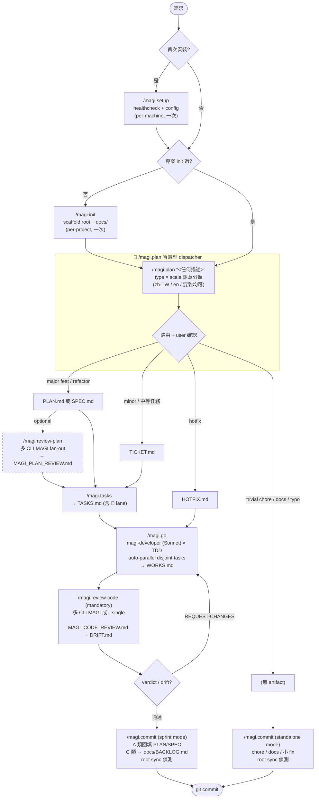

# magi-workflow

[](LICENSE)
[](.claude-plugin/plugin.json)
[](https://claude.com/claude-code)
[](https://www.gnu.org/software/bash/)
[](https://www.conventionalcommits.org)
[](https://github.com/howar31/magi-workflow/stargazers)
[](https://github.com/howar31/magi-workflow/commits/main)
[](https://github.com/howar31/magi-workflow/issues)
[](https://ko-fi.com/howar31)

> 多模型協作的軟體工程 workflow plugin（for Claude Code）

讓不同階段使用對應的 AI 模型發揮各自所長：Opus 規劃、Gemini + Codex + Opus 並行審議、Sonnet 實作，再以 MAGI 加權投票收斂結果。

# 一、介紹

## 特色

- **🧭 自動引導** — 每個 skill 進入時執行狀態 preflight；偵測到不適用指令會明確指示應先執行的步驟，結束時建議下一步動作。使用者無需記憶 plan → tasks → work → review → commit 的執行順序
- **🎯 智慧型 dispatcher** — `/magi.plan "<描述>"` 自動依 type（feat / fix / hotfix / refactor / chore / docs / ...）與 scale（trivial / minor / major）分類，路由至對應 artifact（PLAN / SPEC / TICKET / HOTFIX / none）。修正 typo 不會產出完整 PLAN.md，緊急修復走 fast-path
- **多 CLI 並行審議** — `claude` / `gemini` / `codex` 同步 fan-out 進行 review；採事件流協定，quota 或 auth 失敗時自動降級
- **MAGI 加權投票** — 提供 4 種共識模式（majority / supermajority / unanimous / threshold）；reviewer 失敗時於報告中明示降級狀態
- **契約即真理、自動 drift 偵測** — `/magi.plan` 產出的 PLAN / SPEC / TICKET / HOTFIX 為凍結契約；`/magi.review-code` 自動比對 code 與契約並輸出 `DRIFT.md`（A 類違反、B 類自由選擇、C 類觀察）；`/magi.commit` sprint mode 引導使用者將 A 類回填契約、C 類加入 `docs/BACKLOG.md`
- **雙模式 commit** — `/magi.commit` 自動偵測 sprint context；feature work 採 sprint mode，chore / docs / 小修正採 standalone mode，單一指令涵蓋所有 commit 情境
- **領域中性** — 核心 slash command（init / plan / tasks / review-plan / go / review-code / commit / setup）不綁定特定技術棧
- **Web 領域 add-ons** — frontend / backend / infra / ci 四個專用 spec skill，擴充標準 SPEC.md
- **零自動副作用** — 不執行隱式 commit / push、不 apply infra、不 trigger deploy；每一步均需使用者確認
- **nvm 相容** — 處理 `#!/usr/bin/env node` 解析錯誤版本的問題（macOS 常見）
- **團隊化選配** — `references/AGENTS.md` 為跨專案守則 SSOT；提供選用的 git hooks（Conventional Commits / lint / WIP 警示）

實作完成度與設計細節見 [`SPEC.md`](SPEC.md)。

# 二、設計與架構

## 工作流總覽

magi-workflow 的核心為 `/magi.plan` 智慧型 dispatcher：依描述分類 type × scale，路由至四種對應流程。



讀法：
- **每個指令均有 state preflight**：偵測到不適用會拒絕並指示下一步。圖中省略 preflight 邏輯（每個節點皆有）以維持可讀性
- **虛線 = optional**：`/magi.review-plan` 可省略；使用者亦可自行 review PLAN，節省 token
- **實線 = mandatory**：`/magi.review-code` 必須執行；產出的 `DRIFT.md` 為 `/magi.commit` sprint mode 的必要輸入
- **dispatcher 四條路徑**：trivial 跳過 sprint folder；hotfix 跳過 `/magi.tasks`；TICKET 跳過 review-plan；major 執行完整流程
- **MAGI fan-out**：兩個 review skill 內部均為「多 CLI 平行 + 加權投票」（claude / gemini / codex），實際啟用名單由 `~/.config/magi-workflow/config.json` 控制

### Web add-ons 插入點

四個 web 領域 spec skill 僅於 PLAN.md / SPEC.md / TICKET.md 路徑可插入（hotfix / trivial 路徑跳過）。在 `/magi.plan` 之後、`/magi.review-plan` 或 `/magi.tasks` 之前手動觸發：


僅執行所需的 add-on；四者彼此獨立。每個 add-on 均執行 state preflight，缺少 PLAN / SPEC / TICKET 時拒絕執行。

### 外部 CLI reviewer 執行機制

每個 reviewer 並非常駐 process，亦非獨立 slash command；而是 `orchestrator.sh` 在使用者執行 `/magi.review-plan` 或 `/magi.review-code` 時 spawn 的 subprocess：

1. 使用者執行 `/magi.review-plan`（或 `/magi.review-code`）
2. Coordinator 讀取 `~/.config/magi-workflow/config.json` 的 `xreview.reviewers` 清單
3. `orchestrator.sh` 並行 spawn 每位啟用的 reviewer：
   - `claude --print "<prompt>"`
   - `nvm exec 22 gemini -p "<prompt>"`
   - `nvm exec 22 codex exec "<prompt>"`
4. 每位 reviewer 獨立執行、彼此隔離，各自寫入 `<workdir>/<cli>-<model>.final.txt`
5. 任一位失敗（quota / auth / 其他錯誤）標記為 SKIP / FAIL，其餘繼續執行
6. 全部完成後，`magi-consensus.sh` 彙整 `.final.txt` 並執行加權投票，產出 `magi-report.md`
7. Coordinator 依 `references/MAGI_VOTING.md` 規則執行語意去重與最終裁決
8. 結果回傳

config 控制 fan-out 的「組成」與「失敗策略」，而非「啟動時機」。無 cron、無 hook、無背景 daemon；皆由顯式 slash command 觸發。

## 角色分工

magi-workflow 內部有三個角色。Reviewer 角色提供兩種實作模式：MAGI（多 CLI 並行）與 `--single`（in-session subagent）。

| 角色 | 模型 | 職責 | 不做 |
|------|------|------|------|
| **Coordinator**（main agent） | Opus（使用者的 Claude Code session） | 規劃、派工、驗收、dispatcher 分類、MAGI 投票收斂、drift 處理、commit 訊息產生 | 不撰寫 production code |
| **Developer**（`magi-developer` subagent） | Sonnet | TDD 實作（紅 → 綠 → 重構）、產出 DONE / BLOCKED 報告 | 不做架構決策、不擴大範圍、不 commit |
| **Reviewer**（兩種實作） | 依模式 | review code + drift detection 並產出 `DRIFT.md` | 不修改檔案 |

模型分配的考量：Opus 任 Coordinator 是因為規劃 / 派工 / 收斂審議結果都需要長上下文與穩定推理、且副作用範圍大；Sonnet 任 Developer 因為實作以撰碼為主、追求快速迭代且成本可控；Reviewer 三家並行則追求觀點互補（claude 嚴謹、gemini 廣度、codex 偏實作細節），單一模型易有盲點，加權投票讓共識勝出而非單家獨斷。

### Reviewer 兩種實作模式

| 模式 | 觸發 | 實作 | 輸出 | 適用情境 |
|------|------|------|------|---------|
| **MAGI mode**（default） | `/magi.review-code`、`/magi.review-plan` | 多個外部 CLI（claude / gemini / codex）並行 fan-out + 加權投票 | `MAGI_PLAN_REVIEW.md` / `MAGI_CODE_REVIEW.md` + `DRIFT.md`（含跨模型共識） | 多數情境；多模型角度互補 |
| **`--single` mode** | `/magi.review-code --single` | `magi-reviewer` subagent（in-session Opus） | `SINGLE_CODE_REVIEW.md` + `DRIFT.md`（單一 reviewer） | 節省 token、外部 CLI 不可用、debug |

兩個模式均產出 `DRIFT.md`，下游 `/magi.commit` sprint mode 不需區分輸入來源。

> 擴充新 reviewer CLI（例如 `cursor` / `qwen`）：見 [`SPEC.md` § Adapter contract](SPEC.md#adapter-contract)，依契約實作 `--healthcheck` 與 `run` 兩個模式即可。

## 啟用模式

**每個 slash command 必須由使用者手動輸入 `/magi.<name>` 才會啟動。** 所有 skill 皆帶有 `disable-model-invocation: true`：即使在 plain chat 中向 Claude 表達「幫我 plan 一下」，也不會自動觸發 `/magi.plan`。

設計理由：
- **可預期** — 每次 fan-out 消耗 token 且可能修改檔案，自動觸發風險過高
- **顯式優先** — 由使用者主動觸發；不主動則閒置
- **支援 chat 中討論** — 在 chat 中釐清需求後再執行 `/magi.plan`

> **`/magi.yolo` 同樣適用此規則**：yolo 雖為「無人值守」模式，但仍為 `disable-model-invocation: true` 的 slash command；必須使用者明確輸入 `/magi.yolo "<描述>"` 或 `/magi.yolo --resume` 才會啟動。LLM 不會於 plain chat 中聽到「幫我跑完整個」便擅自觸發 yolo。**「無人值守」指啟動後不向使用者 prompt，並非 LLM 自行決定是否啟動。**

> **進階**：若需切換為 LLM 可自動 invoke，移除 `skills/<name>/SKILL.md` frontmatter 中的 `disable-model-invocation: true`（各 skill 獨立控制）。

## 專案狀態（Project state）

magi-workflow 把專案當前狀況歸納為 8 種 state。**這不是另外維護的狀態檔，而是 `scripts/shared/detect-state.sh` 每次呼叫時即時從檔案系統推導出來的**——換 git branch、手動編輯檔案、刪除 sprint 目錄都會立刻反映，沒有 stale state 的風險。

| State | 偵測條件（檔案存在性） | 典型下一步 |
|-------|--------------------|----------|
| `BOOTSTRAP` | root 沒有 `CLAUDE.md` / `README.md` / `SPEC.md` | `/magi.init` |
| `INITIALIZED` | root 有任一文件，無 active sprint | `/magi.plan "<描述>"` |
| `PLANNING` | sprint 有 `PLAN.md` / `SPEC.md` / `TICKET.md` / `HOTFIX.md`，無 `TASKS.md` | `/magi.tasks`（或可選 `/magi.review-plan`；hotfix 可直接 `/magi.go`） |
| `PLAN_REVIEWED` | 上述 + `MAGI_PLAN_REVIEW.md` | `/magi.tasks` |
| `TASKS_READY` | 上述 + `TASKS.md`，無 `WORKS.md` | `/magi.go` |
| `IN_PROGRESS` | 上述 + `WORKS.md`，仍有未勾選 task | 繼續 `/magi.go`；有 diff 也可先 `/magi.review-code` |
| `WORK_DONE` | TASKS.md 全勾選 | `/magi.review-code` |
| `CODE_REVIEWED` | 上述 + `DRIFT.md` | `/magi.commit` |

每個指令的 preflight 都會讀 state 並比對自己的 `allowed_states`：適用就執行，不適用就拒絕並指向正確的下一步指令（見下節）。指令完成後會更新對應檔案，狀態自然推進到下一個。

不確定目前在哪？執行 `/magi.status` 會以 3–6 行印出當前 state 與建議下一步;若想同時看完整指令清單與 workflow 圖,執行 `/magi.help`。

### Staleness 警告

state 由「檔案是否存在」決定，但「檔案內容是否還新鮮」由 mtime 比較產生 warning（不會降級 state，只是提醒）：

| Warning | 條件 | 受影響的指令 |
|---------|------|------------|
| `stale_plan_review` | `MAGI_PLAN_REVIEW.md` 比 `PLAN/SPEC/TICKET.md` 舊 | `/magi.tasks` 會建議重跑 `/magi.review-plan` |
| `stale_drift` | `DRIFT.md` 比任何已修改的程式檔舊 | `/magi.commit` 會建議重跑 `/magi.review-code` |
| `tasks_without_plan` | 有 `TASKS.md` 但無 plan equivalent | `/magi.go` 會建議補 `/magi.plan` |

完整 state JSON schema、skill 規則表、轉移細節見 [SPEC.md § Project state model](SPEC.md#project-state-model-phase-2)。

# 三、安裝與使用

## 安裝

```bash
claude plugin marketplace add howar31/howar31-marketplace
claude plugin install magi-workflow@howar31
```

或在 Claude Code session 中執行對應 slash command：

```
/plugin marketplace add howar31/howar31-marketplace
/plugin install magi-workflow@howar31
```

安裝後執行 setup wizard：

```
/magi.setup
```

wizard 會檢查本機的 `claude` / `gemini` / `codex`，詢問啟用名單與權重，寫入 `~/.config/magi-workflow/config.json`，最後執行 dry-run 驗證。

新專案首次採用 magi-workflow 時執行：

```
/magi.init
```

偵測缺漏的專案文件（root `CLAUDE.md` / `README.md` / `SPEC.md`、`docs/PRD.md` / `docs/TECHSTACK.md` / `docs/BACKLOG.md`），逐項詢問是否建立 scaffold。idempotent；既有檔案不會被覆寫。

## 環境需求

支援平台：macOS（已測 arm64）、Linux。

| 類別 | 工具 | 用途 / 安裝 |
|------|------|-------------|
| **必要** | `claude` CLI | Coordinator，主要對話介面。安裝：[claude.ai/download](https://claude.ai/download) 或 npm 套件 `@anthropic-ai/claude-code` |
| **必要** | `bash` 3.2+ | 已內建於 macOS / Linux |
| **必要** | `jq` | 處理 config 與事件流 JSON。`brew install jq` 或 `apt install jq` |
| **選用** | `gemini` CLI | 第二位 reviewer。需設定 `GEMINI_API_KEY` 或進行登入。安裝：[github.com/google-gemini/gemini-cli](https://github.com/google-gemini/gemini-cli) |
| **選用** | `codex` CLI | 第三位 reviewer。安裝：[github.com/openai/codex](https://github.com/openai/codex) |
| **建議** | `gtimeout`（coreutils） | 子程序逾時控制；macOS 可透過 `brew install coreutils` 取得 |
| **建議** | nvm + Node 20 / 22 | 供 npm-based CLI（gemini / codex）使用，避免系統 node 版本衝突 |

未安裝 `jq` 或 `gtimeout` 時 `/magi.setup` 的 preflight 會顯示提示，不會無聲失敗。`gemini` / `codex` 任一失敗時 MAGI 會以降級模式繼續執行（詳見 Troubleshooting）。

## 使用流程

magi-workflow 會主動導航，無需背誦指令順序：每個指令的 preflight 會偵測目前 [專案狀態](#專案狀態project-state)，**不適用的指令拒絕執行並指向下一步**；指令完成後也會建議接續指令。隨時 `/magi.help` 即可取得當前狀態 + 建議下一步。下方流程示意是設計參考，遺忘了也不影響操作。

### 標準流程

> 不確定該用哪個指令？執行 `/magi.help` 取得完整指令速查、流程圖、override flags 與 state-aware 下一步建議；`/magi.help <name>`（例如 `/magi.help plan`）查看單一指令細節。

```
/magi.setup                        # 首次安裝（global，per-user）
/magi.init                         # 新專案首次設定（per-project bootstrap）

/magi.plan "<功能描述>"            # 產出 docs/<num>-<slug>/PLAN.md 或 SPEC.md（依複雜度自動判斷）
                                   # 無描述參數時從 docs/BACKLOG.md 選取待 promote 項目
/magi.review-plan                  # 多 CLI MAGI 審議 plan
/magi.tasks                        # 拆解 TASKS.md
/magi.go                           # 派工 magi-developer 實作
/magi.review-code                  # 多 CLI MAGI 審議 code 並產出 DRIFT.md（--single 為單 reviewer 模式）
/magi.commit                       # sprint mode：A 類回填 PLAN/SPEC、C 類加入 BACKLOG、選用 root 同步、Conventional Commits
                                   # standalone mode：chore / docs / 小修正直接 commit（無 sprint context 時自動切換）
```

> 無人值守一次執行完整流程：見 [yolo 模式](#yolo-模式無人值守)。`/magi.yolo "<描述>"` 從頭執行；`/magi.yolo --resume` 接續現有 sprint。

### Web 領域進階流程（在 `/magi.plan` 與 `/magi.tasks` 之間插入）

```
/magi.plan "<功能描述>"
/magi.web.frontend.spec            # 擴充 frontend spec 段落（component / a11y / e2e）
/magi.web.backend.spec             # 擴充 backend spec 段落（API contract / migration）
/magi.web.infra.plan               # 產出 INFRA.md（terraform plan dry-run / IAM diff）
/magi.web.ci.spec                  # 產出 CI.md + workflow YAML 草稿
/magi.review-plan                  # 完成擴充後 review
/magi.tasks
/magi.go
/magi.review-code
```

每一階段需使用者明確確認後才會進入下一步。

## 執行不適用的指令會發生什麼？

不會造成破壞性後果。每個 magi.* skill 進入時皆執行 `scripts/shared/detect-state.sh` 偵測目前專案狀態；偵測到不適用的指令時會明確指示應先執行的指令。例如：

```
$ /magi.go
Cannot run /magi.go: no TASKS.md and not a hotfix sprint (state=PLANNING)
Suggested: /magi.tasks
```

或：

```
$ /magi.review-code
Cannot run /magi.review-code: no diff to review (working tree clean)
Suggested: make some changes or stage them first
```

每個指令結束時亦會建議下一步；使用者依建議執行即可，無需記憶順序。

如需繞過 preflight：所有 skill 均支援 `--force`（少用情境，例如從毀損的 sprint 中段恢復）。

## yolo 模式（無人值守）

適用於 walk-away 場景；不希望執行過程被指令打斷時使用 `/magi.yolo`。提供兩種模式：

```bash
# Fresh：建立新 sprint 並從頭執行
/magi.yolo "<描述>"                       # 執行完整流程至 commit，停在 local
/magi.yolo "<描述>" --push                # commit 後 push（default branch 上需額外 flag）

# Resume：接續現有 sprint
/magi.yolo --resume                       # 接續最新 sprint，從目前 state 繼續執行
/magi.yolo --resume --sprint 03-foo       # 指定 sprint
/magi.yolo --resume --push                # 接續並 push
```

Fresh 模式從 `/magi.plan` 執行至 `/magi.commit`。Resume 模式偵測 sprint 目前 state 並自動跳過已完成的 phase；典型 walk-away 場景：`/magi.plan` 完成後跳過 `/magi.review-plan`，執行 `/magi.yolo --resume`，由 yolo 從 `/magi.tasks` 接續執行至 commit。

兩種模式於任何階段皆不會 prompt 使用者；適用於 walk-away 場景與 CI / scheduled job。

### 自動決策（保守，避免破壞性操作）

| 情境 | 標準模式 | yolo 模式 |
|------|---------|----------|
| Drift A 類（重大契約偏離） | 逐項詢問是否回填 | **auto-ignore**：保留於 DRIFT.md，不修改契約；agent 在無監督下不修改 PLAN / SPEC |
| Drift C 類（out-of-scope 觀察） | 逐項詢問 | **auto-promote** 至 `docs/BACKLOG.md`（append-only，無 destructive side effect） |
| Root 文件同步 | 偵測到觸發訊號 → 詢問使用者 | **auto-skip**：root 文件影響全專案，無監督下不修改 |
| Commit 訊息 | 使用者確認 | main agent 自動產出 Conventional Commits，不詢問 |
| Push（有 `--push` 時） | git push | default branch 拒絕推送，需明確加上 `--allow-push-to-default-branch` |

### 失敗即立即 abort

任何階段失敗（reviewer FAIL、developer BLOCKED、測試未通過、verdict REQUEST-CHANGES）yolo 立即中止並保留中間狀態以便接手。`<sprint>/YOLO_LOG.md` 記錄中斷階段、原因與恢復步驟。yolo 不執行 retry 或 auto-fix。

### 適用情境

- ✅ 機械性任務（dep upgrade、typo fixes、auto-generated patches）
- ✅ CI / scheduled job（無 human session 可進行 prompt）
- ✅ 已釐清需求、信任 magi-workflow 分類結果之情境
- ❌ 重要架構變動（缺乏即時監督）
- ❌ 仍需迭代 plan、依 review 結果調整方向之探索性任務
- ❌ 對 magi-workflow 不熟悉者（建議先以標準流程執行數次、累積信任後再使用 yolo）

完整規格（auto-decision 清單、YOLO_LOG schema、abort recovery hint）見 [`SPEC.md` § yolo mode](SPEC.md)。

## Override flags

各指令支援的 flag 子集：

| Flag | 適用指令 | 範例 / 說明 |
|------|---------|------------|
| `--model <name>` | plan / tasks / work / review-* | `--model opus` — 臨時覆寫 coordinator 模型 |
| `--magi <mode>` | review-plan / review-code | `--magi supermajority`（≥ 2/3 才採納） |
| `--reviewers <list>` | review-plan / review-code | `--reviewers claude,gemini` — 停用 codex |
| `--single` | review-code | 降級為 `magi-reviewer`（Opus）單 reviewer 模式 |
| `--diff <range>` | review-code | `--diff origin/main..HEAD` |
| `--staged` | review-code | 僅審議 staged 變動 |
| `--workdir <path>` | review-plan / review-code | 重用既有 workdir，跳過 fan-out 並重新執行 consensus |
| `--milestone N` | work | `--milestone 2` — 派工指定 milestone |
| `--task T<m>.<n>` | work | `--task T2.3` — 派工單一任務 |
| `--parallel` | work | 同 milestone 內標記 🔀 的任務並行派工 |
| `--reset` / `--recheck` | setup | 清除 config 重新設定 / 保留 config 重新驗證 |

完整 flag 規格見 [`SPEC.md` § Override flags](SPEC.md#override-flags-phase-b)。

# 四、進階與維運

## Config

預設 config 位於 `config/default.json`。覆寫設定置於 `~/.config/magi-workflow/config.json`。

修改設定的兩種方式：
- **互動式**：重新執行 `/magi.setup`（引導重設 reviewer 名單、權重、MAGI mode 等）
- **手動**：直接編輯 `~/.config/magi-workflow/config.json`（完整 schema 見 [`SPEC.md` § Config schema](SPEC.md#config-schema)）

```jsonc
{
  "xreview": {
    "reviewers": [
      {"cli": "claude", "model": "opus", "weight": 1, "required": true},
      {"cli": "gemini", "model": "default", "weight": 1, "required": false},
      {"cli": "codex",  "model": "default", "weight": 1, "required": false}
    ],
    "magi": {"mode": "majority", "degraded_mode": "warn_user"},
    "fallback_policy": "lenient",
    "min_successful_reviewers": 1
  },
  "node": {"use_nvm": true, "default_version": "22"}
}
```

## 選配：團隊 Git Hooks

```bash
# 在目標專案內執行：
bash /opt/projects/magi-workflow/hooks/install.sh

# 或手動複製：
cp /opt/projects/magi-workflow/hooks/{commit-msg,pre-commit,pre-push} .git/hooks/
chmod +x .git/hooks/{commit-msg,pre-commit,pre-push}
```

啟用後：
- `commit-msg` — 強制要求 Conventional Commits 格式
- `pre-commit` — 自動偵測並執行專案的 lint / typecheck（pnpm / npm / ruff / mypy / go vet / cargo clippy）
- `pre-push` — WIP / FIXME 警示（不阻擋推送）

緊急 bypass：`MAGI_SKIP_HOOKS=1 git commit ...`

## Troubleshooting

### Reviewer 失敗時的行為

`orchestrator.sh` 將每位 reviewer 標記為 `RETURN`（成功）、`SKIP`（quota / auth / missing）或 `FAIL`（其他錯誤），其餘 reviewer 繼續執行。MAGI 報告開頭明確標示 **DEGRADED MODE**（可用 reviewer 少於設定的 reviewer 數量，或僅剩 1 位）。

### 常見狀況對應

| 狀況 | 處理 |
|------|------|
| Claude quota 耗盡 | 等待冷卻或更換帳號；或臨時執行 `/magi.review-code --reviewers gemini,codex` 略過 claude |
| Gemini auth 失敗 | 透過 `gemini` CLI 重新登入（`GEMINI_API_KEY` 或互動式 login）；或以 `--reviewers claude,codex` 略過 |
| Codex 未安裝 | preflight 直接 SKIP，其他 reviewer 持續執行 |
| 全部 reviewer 不可用 | 執行 `/magi.review-code --single` 降級為 `magi-reviewer`（Opus）單 reviewer |
| nvm node 版本不正確 | 修改 `~/.config/magi-workflow/config.json` 的 `node.default_version`，或設定 `xreview.node_version_per_cli.<cli>` |
| `jq` / `gtimeout` 未安裝 | macOS：`brew install jq coreutils`；Linux：`apt install jq coreutils` |

### 健檢 / 重設

- `./scripts/shared/preflight.sh` — 執行健檢，列出可用 reviewer
- `/magi.setup --recheck` — 保留 config 並重新驗證
- `/magi.setup --reset` — 清除 config 並重新執行 wizard

### 輸出檔位置

依 **Project document tiers** 三層歸屬：

**Tier 1 — Root**（高頻入口參考；`/magi.init` 一次建立、`/magi.commit` 持續同步）

| 檔案 | 角色 |
|------|------|
| `CLAUDE.md` | AI agent 索引 |
| `README.md` | human-readable 說明 |
| `SPEC.md` | architecture spec |

**Tier 2 — `docs/`**（流程支援檔；`/magi.init` 建立空 scaffold）

| 檔案 | 角色 |
|------|------|
| `docs/PRD.md` | 產品需求 |
| `docs/TECHSTACK.md` | 技術棧約束 |
| `docs/BACKLOG.md` | 待 promote 項目（`/magi.commit` 寫入；`/magi.plan` 無描述參數時讀取） |

**Tier 3 — `docs/<num>-<slug>/`**（per-feature；`/magi.plan` 建立、sprint 結束後凍結）

| 指令 | 輸出 |
|------|------|
| `/magi.plan` | `PLAN.md` 或 `SPEC.md`（依複雜度自動判斷） |
| `/magi.tasks` | `TASKS.md` |
| `/magi.go` | `WORKS.md` |
| `/magi.review-plan` | `MAGI_PLAN_REVIEW.md` |
| `/magi.review-code`（MAGI） | `MAGI_CODE_REVIEW.md` + `DRIFT.md`（一律產出，`Status: NONE` / `DETECTED`） |
| `/magi.review-code --single` | `SINGLE_CODE_REVIEW.md` + `DRIFT.md` |
| `/magi.web.infra.plan` | `INFRA.md`（含 `plan.tfplan` / `plan.json`） |
| `/magi.web.ci.spec` | `CI.md` + workflow YAML 草稿 |

## 升級與移除

```bash
# 同步最新 marketplace 內容
claude plugin marketplace update howar31

# 升級 plugin
claude plugin update magi-workflow

# 若 schema 變動，重新執行 setup 驗證
/magi.setup --recheck

# 移除 plugin（保留 marketplace 註冊）
claude plugin uninstall magi-workflow

# 連同 marketplace 一併移除
claude plugin marketplace remove howar31
```

> 預設不自動更新。如需啟動時自動同步，於 Claude Code 內執行 `/plugin marketplace`，於 `howar31` 條目開啟 auto-update；更新後會提示 `/reload-plugins`。

config 位於 `~/.config/magi-workflow/config.json`；移除 plugin 不會自動刪除 config，如需完全清除請執行 `rm -rf ~/.config/magi-workflow/`。

## 尚未涵蓋的情境（已知限制）

magi-workflow 目前刻意不處理下列兩種情境，待實際使用累積足夠 evidence 後再評估。明列於此以避免誤判為使用方式錯誤。

### 多人團隊並行 sprint 的衝突

magi-workflow 的 state 偵測（`detect-state.sh`）預設以「最新 sprint」為基準。當多位開發者於同一 repo 並行不同 feature branch、各自存在 active sprint 時可能發生：
- `/magi.commit` 自動偵測模式選錯 sprint（已有 `--sprint <slug>` 為手動指定 escape hatch）
- 兩個 sprint 同時修改 root SPEC.md 時的 merge 整合策略
- 跨 sprint 的 review 共識與 commit 順序協調

**現行對策**：使用 `--sprint <slug>` 明確指定，或約定每個 branch 僅執行一個 sprint。完整方案待團隊化使用累積實際 pain point 後再評估。

### B 類偏離的累積回饋（Reflexion 強化）

`/magi.review-code` 的 DRIFT.md 將 B 類條目（implementation 在契約之下的自由選擇）保留為 audit trail，不主動提醒處理。長期觀察下，**若某類 B 條目反覆出現**，代表契約對該層級不夠具體，PLAN / SPEC 應再往下深化。

**現行對策**：B 類條目靜態保留，由使用者自行查閱 DRIFT.md 識別 pattern 後執行 `/magi.plan --into <sprint>` 修訂契約。自動化提醒閾值待累積實際 sprint 的 B 類密度資料後評估。

## 設計原則

- **顯式優先** — 所有副作用較大的動作均需手動觸發；plugin 不執行隱式 commit / push、不 apply infra、不 trigger deploy。**例外**：[`/magi.yolo`](#yolo-模式無人值守) 為 opt-in 的「無人值守」模式，使用者執行該指令即視為顯式同意；yolo 在無監督下對 destructive 操作（A 類 drift 回填、root 文件修改、force push）採保守 auto-skip 並全程寫 audit log。**未執行 `/magi.yolo` 時，顯式優先原則完全適用**；兩者為獨立執行路徑，並非違反原則
- **降級透明** — reviewer 失敗時 MAGI 報告明確標示「DEGRADED MODE」
- **領域中性** — 核心流程（plan / tasks / work / review）不綁定任何技術領域；web 為首個 add-on
- **不硬綁特定模型版本** — 採短名 `opus` / `sonnet`，模型換代時無需修改 plugin
- **狀態純由檔案推導** — magi-workflow 不儲存任何 state 檔；每次指令執行前由 `scripts/shared/detect-state.sh` 即時計算目前 state。切換 git branch、修改檔案、刪除檔案均能即時反映，無 stale 假設

## License

MIT
